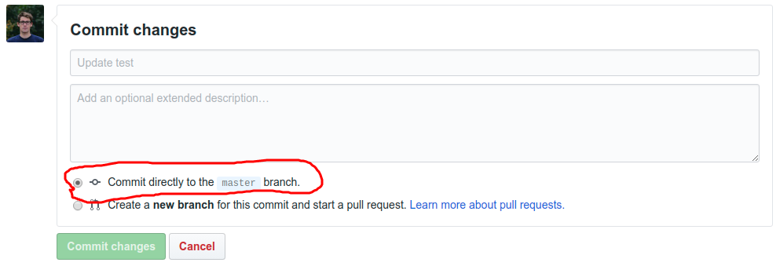
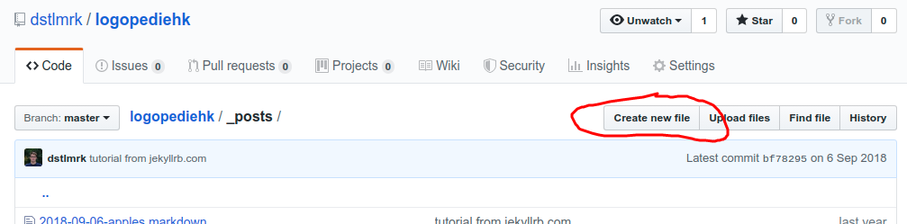
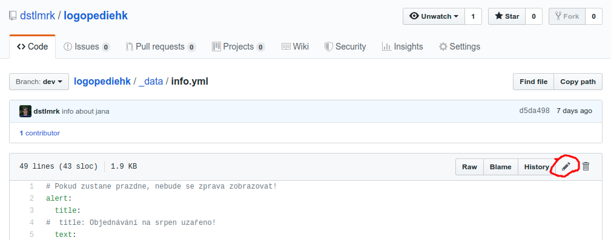

# Logopedie Hradec Králové

## Jak to celé funguje

POZOR! Každá změna zahrnuje editaci souborů. Pro aktivaci změn je nutné
pod editací kliknout na tlačítko `Commit changes` a mít zaškrtnutou první možnost.



Změna by se měla na [logopedie.cz](www.logopedie.cz) projevit do minuty maximálně dvou.

### Jak přidat novou aktualitu

- Na úvodní stránce se zobrazují příspěvky staré maximálně dva měsíce. Ostatní lze najít
  na stránce `Aktuality z oboru`.

- Ve složce `_posts/` stačí vytvořit soubor
  s názvem ve formátu: `YYYY-MM-DD-nazev.md`.

  

- Obsah souboru se tvoří pomocí jazyka
  [Markdown](https://github.com/adam-p/markdown-here/wiki/Markdown-Cheatsheet).

- Na začátku souboru se musí objevit speciální tři řádky, které nastavují titulek aktuality.
  Zbytek souboru se píše pomocí Markdown. Například:
  ```

  ---
  title: Sem se píše titulek
  ---

  První odstavec.

  Druhý odstavec. Atd.
  ```

- Pokud chceš vložit obrázek, tak ho nahraj do složky `assets/img/posts/`.
  V textu jej zobrazíš takto:
  ```markdown
  
  ```

### Jak se vytváří důležité upozornění na stránce

V souboru `_data/info.yml` ([zde](https://github.com/dstlmrk/logopediehk/blob/master/_data/info.yml))
je nutné změnit následující část:

```yaml
alert:
  title:
  text:
```

... na tebou zvolený text. Například:

```yaml
alert:
  title: Pozor dovolená!
  text: V období 15. až 27. je ordinace zcela uzavřena.
```

Pokud zůstanou pole prázdná, tak se na stránce žádné upozornění objevovat nebudou.

Upravovat soubor lze po kliknutí na symbol tužky:



### Jak se upravují kontakty, seznam pojišťoven nebo info o lékařích

Stejně jako v přechozí části. V souboru `_data/info.yml` jsou jednotlivé
informace připravené na změnu.

## How to run (for developers)

```bash
bundle exec jekyll serve
```

Docs: https://jekyllrb.com/
